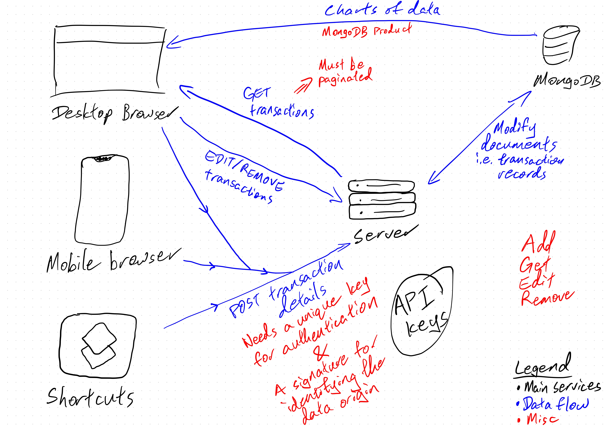

# Finance Tracker App

A finance tracker app built to fulfill my requirements of what I need to track finances with my partner.

**Note:** This is a work in progress. I'm still learning Rust and SvelteKit, so the code can definitely be improved. Furthermore, this will be a long-term project, so I'll be adding features as I go along.

## Motivation

I couldn't find a suitable finance tracker app that suited our needs. We want the flexibility to track individual expenses and incomes, but also be able to track joint expenses and incomes.

There are also other features we want to add in the future, such as being able to track our savings and investments.

Admittedly, I didn't do much research into existing finance tracker apps, but I did look at a few and none of them suited our needs. Thus, I decided to build my own as a learning experience.

## Tech Stack

### Backend

- Rust
- Axum
- MongoDB

_This is the repository for the backend._

### Frontend

- SvelteKit

_The repository for the frontend can be found [here](https://github.com/darricheng/finance-tracker-web-frontend)._

## Data-related Sketches

**Initial idea for data flow between devices and the backend**

**Data structure**

**Data flow for adding a transaction**

**Idea for API Key authentication flow**

## Website Structure & Wireframe Sketches

**Initial website structure**

**Desktop wireframes**

**App Dashboard wireframe**

**Transactions wireframe**

